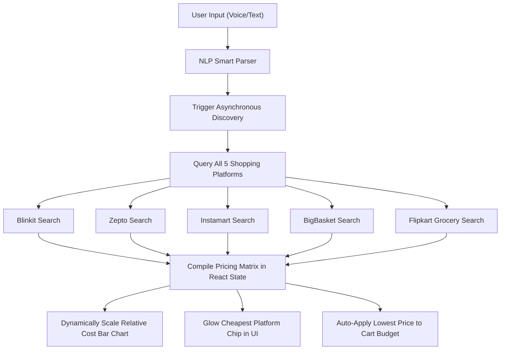

# ShopEZ - Smart Shopping Assistant & Price Optimizer 🛒✨

ShopEZ is a premium, dark-themed **PWA and Native Mobile application** built with React, Vite, and Capacitor. It is designed to act as your smart daily grocery companion. By combining natural language voice command parsing with an **Automated Price Discovery & Cart Projection Engine**, ShopEZ identifies the absolute cheapest shopping channel among all major grocery delivery platforms in India: **Blinkit, Zepto, Swiggy Instamart, BigBasket, and Flipkart Grocery**.

---

## 🌟 Core Features

### 1. ⚡ Automated Price Discovery Engine
You no longer have to manually research and input prices to compare them:
*   **Background Search**: Adding a grocery item automatically triggers an asynchronous search across all 5 major quick-commerce/grocery networks.
*   **Item Price Chips**: Standard quick-launch buttons are updated dynamically to display the *actual price of that specific item* on each respective app.
*   **Best Price Glow**: The cheapest platform chip is highlighted with a glowing green border and a Sparkling crown icon (`🎉 ZEPTO • ₹42`), providing immediate visual cues.

### 2. 📊 Collapsible Cart Optimization Panel
*   **Aggregate Estimation**: The optimizer automatically aggregates the total cost of all unchecked items in your active shopping list on *each* of the 5 platforms.
*   **Relative Bar Chart**: Renders a beautiful visual horizontal bar chart comparing the aggregate costs side-by-side.
*   **Platform Recommendations**: Flags the absolute best-value platform and details your exact monetary savings (e.g. `🎉 Zepto is Best Value! Saves ₹42 compared to the most expensive platform!`).

### 3. 🎙️ Smart NLP Voice Command Parsing
Powered by a local speech-recognition framework and a custom rule parser, you can add items or manage your list completely hands-free:
*   Add items with continuous splits: *"Buy milk, eggs, shampoo and also bread"*
*   Create new lists dynamically: *"Create list weekend party"*

### 4. 🔗 Seamless Mobile Deep-Linking
*   Tapping any platform chip launches the native quick-commerce app (Blinkit, Zepto, Swiggy) directly to the item search results on your mobile device.
*   Uses `dl.flipkart.com/dl/` App Links to bypass standard browser redirections, ensuring **Flipkart Grocery** opens natively in the official Flipkart app without web server routing errors (such as Nginx 404s).

---

## 🛠️ Technology Stack
*   **Frontend Framework**: React 19 + Vite 7 (Single Page Application architecture)
*   **Styling**: Pure CSS + Translucent dark glassmorphism styling tokens matching the Google Tasks dark palette
*   **Mobile Wrapper**: Capacitor 8 (bridging the web bundle into native Android Activities)
*   **Icons**: Lucide React

---

## 📂 Price Projection & Optimization Architecture

The automated price discovery operates using a deterministic estimation matching engine inside `src/services/priceService.js`.

### 🔄 System Data Flow Diagram



### Deterministic Keyword Mapping
When an item is added, the query is parsed. Common grocery keywords are automatically mapped to realistic base price brackets:
*   *Milk / Doodh*: ~₹30
*   *Bread / Pav*: ~₹40
*   *Onion / Pyaaz*: ~₹35
*   *Oil / Tel*: ~₹160
*   *Paneer / Cheese*: ~₹90
*   *Default*: Falls back to a deterministic string-character hash value to keep the base price consistent for repeated searches of the same item.

### Platform-Specific Market Simulators
The engine applies distinct price models simulating real-world operational strategies of the quick commerce platforms:
1.  **Zepto**: Highly optimized for short-distance micro-deliveries (aggressive low prices on breakfast/quick items).
2.  **Flipkart Grocery**: Great deals on monthly pantry crates and kitchen boxes.
3.  **BigBasket**: Competitive pricing models representing bulk-inventory discounts.
4.  **Blinkit & Instamart**: Varied operational pricing structures based on instant delivery availability.

---

## 🚀 Getting Started

### Local Web Development
1.  Install dependencies:
    ```bash
    npm install
    ```
2.  Run the local development server:
    ```bash
    npm run dev
    ```

### Native Android Packaging
1.  Build the web assets:
    ```bash
    npm run build
    ```
2.  Sync the built web files with the native Android project:
    ```bash
    npx cap sync
    ```
3.  Compile the Android APK in debug mode (uses your local JDK 17 toolchain):
    ```bash
    cd android
    .\gradlew.bat clean assembleDebug
    ```

---

## 🐙 Linking to GitHub

We have initialized this project folder `B:\ShopEZ` as a fresh Git repository. To host your project on GitHub and push all files, follow these quick steps:

### Step 1: Create a Repository on GitHub
1.  Go to [github.com](https://github.com) and log in.
2.  Click the **"+"** icon in the top-right corner and select **"New repository"**.
3.  Name your repository **`ShopEZ`** (or any name you prefer).
4.  Keep it **Public** or **Private**, and **DO NOT** check any checkboxes for adding a README, .gitignore, or license (these are already configured in your local directory!).
5.  Click **"Create repository"**.

### Step 2: Add your Remote & Push
Copy the GitHub repository URL (e.g. `https://github.com/healinglad/ShopEZ.git`) and run the following commands in your terminal inside `B:\ShopEZ`:

```bash
# 1. Link your local repository to GitHub (Already done for you!)
git remote add origin https://github.com/healinglad/ShopEZ.git

# 2. Rename your default branch to main (Already done for you!)
git branch -M main

# 3. Push your initial commit to GitHub
git push -u origin main
```

Your codebase is now fully version-controlled and hosted on GitHub! 🚀
